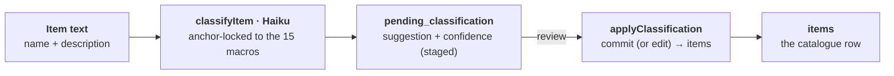

# Ballpark — Taxonomy & Categories

How catalogue items are organised: a fixed **category → subcategory** hierarchy, a separate **tag** facet system, and an **AI auto-classifier** that sorts items into both. All on the `categories` / `tag` tables — subcategories are just child categories.

---

> ⚠ **Adoption status — the crucial reality:** the taxonomy **backend is fully built and running**, but only the **hierarchy** (category + subcategory browse & admin curation) is adopted in **v2**. The **tag facet** and the whole **AI classification** workflow (`/api/taxonomy/*`, `taxonomy.service`) run **through the v1 client only** — `client-v2` makes zero calls to it, and v2 item-edit is a **category-select only** (no subcategory field, no tags, no AI). So "is subcat working in v2?" → the *data + browse* yes; *classifying/tagging an item* is v1-only.

---

## Auto-classification — item text in, hierarchy + facets out

**What lands on the item — two axes:**

| Axis | Cardinality | Columns |
|---|---|---|
| **Hierarchy** (one placement) | one per item | `category_id` → 1 of 15 macros · `subcategory_id` → a child (`parent_id`) |
| **Facet** (many, filterable) | many per item | tags via `supplier_item_tag`, grouped by `dimension` (event-type…) |

> Pipeline + tags run in **v1 only** today · v2 uses the hierarchy (browse + curation), not the classifier.

---

## The hierarchy — categories & subcategories

- **One table, self-referential.** `categories(id, name, parent_id, namespace, icon_name, sort_order, cover_image_url, is_active…)`. A **subcategory is a `categories` row with `parent_id` set**; top-level macros have `parent_id IS NULL`.
- **15 fixed macro categories** (≈131 subcategories). Seeded across `seed.js` + idempotent ensures in `migrate-schemas.js`; canonical list + children in `migrate-taxonomy-v2.js` (`PARENTS` / children map).
- **`namespace`** splits `'catalogue'` (marketplace) from `'feedback'` — same table, different trees.
- **Item placement:** `items.category_id` = the macro; `items.subcategory_id` = a child. A trigger enforces the subcategory's `parent_id` equals the item's `category_id`.

## The facet — tags (a separate axis)

- **`tag` table:** `(id, category_id, dimension, label)`, `UNIQUE(category_id, dimension, label)` — tags are **scoped to a macro category** and grouped by a **`dimension`** (e.g. `stand-size`, `setting`, `event-type`).
- **Item ↔ tag = `supplier_item_tag`** (`UNIQUE(item_id, tag_id)`), with a trigger rejecting any tag whose `category_id ≠ item.category_id`.
- **Hierarchy vs facet:** category/subcategory is *one* placement per item; tags are *many*, dimension-scoped, and the intended **filter** axis.
- **`event-type` is deliberately duplicated** across ~12 categories (Option-A) because the tag→item trigger needs same-category tags; `eventTypes()` unions them for a cross-category "All" filter.

---

## Services

- **`category.service.js`** (96 lines) — thin, namespace-aware CRUD over `categories` (`getAll` / `getByNamespace` / `create` / `update` / `softDelete`). A flat gateway, no tree.
- **`taxonomy.service.js`** (~1568 lines, `HAIKU_MODEL`) — the classifier + curation engine: `loadTaxonomy` (tree) · `classifyItem` (AI → category/subcategory/tags/confidence, staged to `pending_classification`) · `applyClassification` (trigger-safe commit) · `suggestSubcategory` / `backfillSubcategories` · `setItemTags` · `getDimensions` · `eventTypes` · `matchItems` (Brief-tab matcher) · RFQ helpers (`requestQuotes`…).

> **Behemoth watch:** `taxonomy.service.js` at 1568 lines is the largest service — a split candidate (classifier vs Brief-matcher vs RFQ).

## Surface (routes + v2 client)

- **`/api/v2/marketplace/categories*`** — v2 browse rail + counts, admin curation (`PATCH`, gated), and `GET /categories/:id/subcategories`. This is what v2 uses.
- **`/api/taxonomy/*`** — the full classify / apply / tags / dimensions / match / RFQ surface. Mounted & live, but called **only by `client-angular` (v1)**.
- **`/api/categories`** (v1) — read-only since v2.14c; writes moved to the gated v2 marketplace route.
- **v2 client:** `catalogue.service` + `category-strip` / `subcat-card` (browse), `categories-settings` (top-level curation only), `item-edit` (**category select only**).

---

> **Live vs shelved / stale:** the backend (service + `/api/taxonomy` routes + DB triggers + idempotent migrations) is **complete and not dormant** — the gap is purely that **v2's UI hasn't adopted the tag facet or the AI-classification workflow** (they live behind v1). `getDimensions`'s own comment flags the v2 marketplace tag-filter as future. **Stale remnants:** the pre-v2 free-text `categories.tags[]` + `items.tags[]` arrays (superseded by `tag` / `supplier_item_tag`), and `categories.icon` (legacy) coexisting with `icon_name` / `icon_color`. **Relevant to item-import:** Phase-2 AI micro-sort reuses `classifyItem` / `suggestSubcategory` (not net-new); but even V1 "picked subcategory" needs a **new v2 write path** — v2 item-edit can't set `subcategory_id` today.
